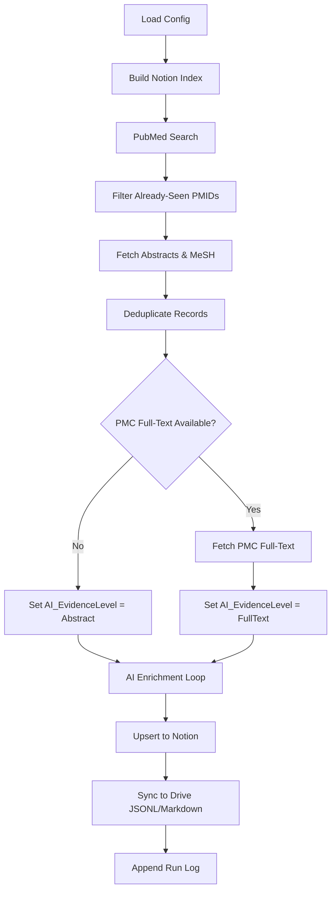

# Literature Intelligence (LitIntel) – Technical Details

**This document describes the internals**. For a quick overview, see `README.md`.

---

## 1. System Overview

LitIntel is a modular, tiered literature pipeline. Configuration is YAML-driven, AI enrichment is multi-provider, and outputs flow to Notion, Google Drive, and CSV.

### Core Principles

1.  **Memory, Not Search**: The pipeline doesn't just find papers—it remembers them. Notion stores structured insights, Drive stores machine-readable JSONL.
2.  **Provenance**: Every record knows where its data came from (`AI_EvidenceLevel`, `FullTextUsed`, `PipelineConfidence`).
3.  **Dual-Confidence Accessions**: GEO/SRA IDs are extracted via regex (`_Candidates`), then validated by AI (`_Validated`).
4.  **Cost-Aware AI**: OpenAI uses a Nano→Mini escalation strategy; Gemini uses native JSON mode.

---

## 2. Configuration (`configs/*.yaml`)

Example: `configs/tier1_pca.yaml`

```yaml
pipeline_tier: 1
pipeline_name: "PCa_Triage_GoldStandard"

discovery:
  mode: KEYWORD
  queries:
    - >
      ("Prostatic Neoplasms"[MeSH Terms] OR prostate[tiab] ...)
      AND ("spatial transcriptom*"[tiab] OR ...)
  retmax: 50
  reldays: 120

ai:
  provider: openai  # or gemini
  model_default: "gpt-5-nano"
  model_escalate: "gpt-5-mini"
  prompt_template: "tier1_pca"

storage:
  notion:
    enabled: true
    database_id_env: "NOTION_DB_ID"
  drive:
    enabled: true
    folder_id_env: "GOOGLE_DRIVE_FOLDER_ID"
  csv:
    enabled: true
    filename: "papers_tier1.csv"

dedup:
  keys: ["DOI", "PMID"]
```

---

## 3. Pipeline Flow (`src/litintel/pipeline/tier1.py`)



---

## 4. Data Schema (`src/litintel/enrich/schema.py`)

### BaseRecord (inherited by all tiers)

| Field | Type | Notes |
|-------|------|-------|
| `PMID` | str | PubMed ID |
| `DOI` | Optional[str] | DOI |
| `Title` | str | Paper title |
| `Abstract` | str | Abstract text |
| `FullTextUsed` | bool | Was PMC full-text available? |
| `AI_EvidenceLevel` | str | "Abstract" or "FullText" |
| `PipelineConfidence` | str | "Low", "Medium", "High", "Error" |
| `WhyYouMightCare` | Optional[str] | Decision-support insight |
| `GEO_Candidates` | Optional[str] | Regex-extracted GEO IDs |
| `GEO_Validated` | Optional[str] | AI-validated GEO IDs |
| `MeSH_Major` | Optional[str] | Major MeSH headings |

### Tier1Record (extends BaseRecord)

| Field | Type | Notes |
|-------|------|-------|
| `RelevanceScore` | int | 0-100 |
| `WhyRelevant` | str | 1-sentence justification |
| `StudySummary` | str | 2-3 sentences |
| `PaperRole` | str | Role in the field |
| `Theme` | str | Semicolon-separated tags |
| `Methods` | str | Platforms + tools |
| `KeyFindings` | str | Semicolon-separated |
| `DataTypes` | str | Controlled vocab |
| `Group` | str | PI / Lab |
| `CellIdentitySignatures` | str | e.g., "Basal: KRT5, KRT14" |
| `PerturbationsUsed` | str | e.g., "PTEN loss; Enzalutamide" |

---

## 5. AI Enrichment (`src/litintel/enrich/`)

### Provider Abstraction

-   **OpenAI**: Uses `response_format: {"type": "json_object"}`. Model selection is automatic: `gpt-5-nano` by default.
-   **Gemini**: Uses `response_mime_type: "application/json"` with a full Pydantic-derived schema.

### Shadow Judge Escalation

Papers with **ambiguous scores (70-79)** or structural issues are validated by `gpt-5-mini`:

1. **Deterministic Heuristics** (`escalation_heuristics.py`):
   - H1: Short rationale (< 50 chars)
   - H2: Score in ambiguous range [70-79]
   - H3: Text/score mismatch
   - H4: High relevance but low reuse
2. **Shadow Judge**: Mini reviews raw text and may overturn Nano (with quoted evidence)
3. **Guardrail**: Pipeline halts if overturn rate > 25%

### Computational Methods (`comp_methods`)

Full-text papers get structured methods extraction:

```json
{
  "analyses": [
    {
      "analysis_name": "Single-cell preprocessing",
      "purpose": "To normalize and integrate samples",
      "steps": [
        {"step": "SCTransform", "tool": "Seurat v5", "rationale": "Variance stabilization"}
      ]
    }
  ],
  "stats_models": ["Negative binomial"],
  "tags": ["integration", "batch_correction"]
}
```

### Prompt Templates (`prompt_templates.py`)

-   `TIER1_SYSTEM_PROMPT`: PhD-level curator for prostate cancer spatial omics.
-   `TIER2_SYSTEM_PROMPT`: Methods-focused curator.
-   Controlled vocabulary for `DataTypes` (e.g., `scRNA-seq`, `Visium`, `multiome`).
-   Instructions for `Group` extraction (Corresponding Author → Last Author → Fallback).
-   GEO/SRA validation logic: "Include only if clearly from THIS study."

---

## 6. Storage Backends (`src/litintel/storage/`)

### Notion (`notion.py`)

-   **Upsert**: Creates pages for new papers, can update existing.
-   **Dedup Index**: Builds `PMID → page_id` map to skip already-ingested papers.
-   **Field Mapping**: `_build_tier1_properties()` maps Pydantic fields to Notion property types.
-   **Truncation**: All text fields capped at 2000 chars for API compliance.

### Google Drive (`drive.py`)

-   **JSONL**: `papers.jsonl` in root folder (machine-readable log).
-   **Markdown Buckets** (in `NotebookLM_Corpus/`):
    -   `Literature_{Year}_Q{Q}.md`: All papers, sorted by score.
    -   `HighConfidence_Analysis.md`: Papers with `RelevanceScore >= 90`.
    -   `CompMethods_{Year}_Q{Q}.md`: Computational methods from full-text papers.
-   **Local Markdown**: `papers_tier1_validated.md` - Only Shadow Judge validated papers (human QA).

---

## 7. Prefect Deployment (`.deployment/`)

### `biweekly_flow.py`

A Prefect `@flow` that wraps `run_tier1_pipeline`. Loads config from `configs/tier1_pca.yaml`.

### `deploy_scheduled.py`

Registers the flow with Prefect Cloud:

-   **Schedule**: Biweekly (RRule).
-   **Source**: Git-based (clones from GitHub at runtime).
-   **Work Pool**: `literature-managed-pool` (Prefect Managed / Serverless).

---

## 8. Troubleshooting

| Error | Cause | Fix |
|-------|-------|-----|
| `ImportError: load_config_from_yaml` | Old code version | Pull latest from GitHub. |
| `API 429 (Rate Limit)` | Too many requests | Increase `time.sleep()` in AI loop. |
| `NOTION_DB_ID not set` | Missing env var | Check `.env` and `load_dotenv()`. |
| `MissingFlowError` in Prefect | Old repo referenced | Ensure `deploy_scheduled.py` points to correct GitHub URL. |

---

## 9. Cost Estimates

| Service | Usage | Cost (Monthly) |
|---------|-------|----------------|
| NCBI | ~400 requests/run | Free |
| OpenAI (Nano) | ~50 papers/run | ~$0.01 |
| Notion | ~50 writes/run | Free |
| Prefect Cloud | 2 runs/month | Free |

---

## 10. Legacy Code

The `modules/` directory and `literature_flow.py` contain the original flat-file implementation. These are preserved for reference but **not used by the active pipeline**. All production code lives in `src/litintel/`.