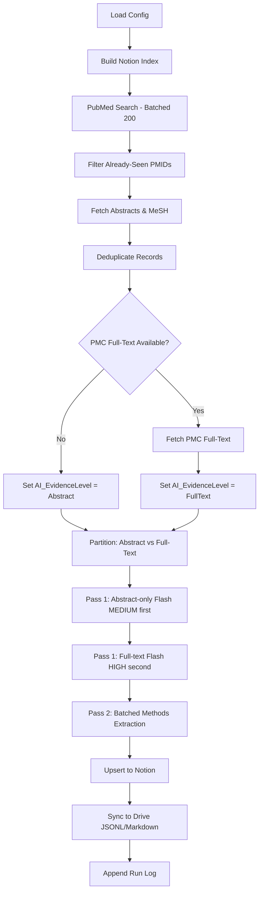

# Literature Intelligence (LitIntel) - Technical Details

**This document describes the internals**. For a quick overview, see `README.md`.

---

## 1. System Overview

LitIntel is a modular, tiered literature pipeline. Configuration is YAML-driven, AI enrichment uses a Two-Pass architecture with OpenAI or Gemini, and outputs flow to Notion, Google Drive, and CSV.

### Core Principles

1. **Memory, Not Search**: The pipeline doesn't just find papers--it remembers them. Notion stores structured insights, Drive stores machine-readable JSONL.
2. **Provenance**: Every record knows where its data came from (`AI_EvidenceLevel`, `FullTextUsed`, `PipelineConfidence`).
3. **Dual-Confidence Accessions**: GEO/SRA IDs are extracted via regex (`_Candidates`), then validated by AI (`_Validated`).
4. **Cost-Aware AI**: Two-Pass Architecture with cache-optimized processing order.

---

## 2. Configuration (`configs/*.yaml`)

Example: `configs/tier1_pca.yaml`

```yaml
pipeline_tier: 1
pipeline_name: "PCa_Triage_GoldStandard"

discovery:
  mode: KEYWORD
  queries:
    - >
      ("Prostatic Neoplasms"[MeSH Terms] OR prostate[tiab] ...)
      AND ("spatial transcriptom*"[tiab] OR ...)
  retmax: 25
  reldays: 180

ai:
  provider: gemini
  # Two-Pass Architecture
  pass1_model_fulltext: "gemini-3-flash-preview"   # Pass 1 (Scoring) if Full Text
  pass1_thinking_fulltext: "HIGH"                   # Thinking level for full-text scoring
  pass1_model_abstract: "gemini-3-flash-preview"   # Pass 1 (Scoring) if Abstract Only
  pass1_thinking_abstract: "MEDIUM"                 # Thinking level for abstract scoring
  pass2_model: "gemini-3.1-pro-preview"            # Pass 2 (Methods extraction)
  pass2_thinking: "LOW"                             # Thinking level for methods extraction
  pass2_min_score: 88                 # Trigger threshold for Pass 2

  max_chars: 80000
  prompt_template: "tier1_pca"

  escalation_triggers:
    score_range: [70, 79]       # H2: Ambiguous relevance range
    min_rationale_length: 50    # H1: Short rationale threshold
    escalate_on_high_reuse: 4   # H4: High Reuse Score
    h3_high_score_thresh: 80    # H3: High score threshold for mismatch
    h3_low_score_thresh: 70     # H3: Low score threshold for mismatch
    escalate_min_score: 87      # H5: Direct escalation for High Tier 3+
    retry_on_error: true        # Malformed JSON -> retry with escalate model

storage:
  notion:
    enabled: true
    database_id_env: "NOTION_DB_ID"
  drive:
    enabled: true
  csv:
    enabled: true
    filename: "papers_tier1.csv"

dedup:
  keys: ["DOI", "PMID"]
```

---

## 3. Pipeline Flow (`src/litintel/pipeline/tier1.py`)



### Cache-Optimized Processing Order

To maximize Gemini prompt caching (~50% cost reduction):

1. **Abstract-only papers** processed first with `gemini-3-flash-preview` (MEDIUM thinking)
2. **Full-text papers** processed second with `gemini-3-flash-preview` (HIGH thinking)
3. **Pass 2** runs in parallel batch after all Pass 1 completes, using `gemini-3.1-pro-preview` (LOW thinking)

---

## 4. Data Schema (`src/litintel/enrich/schema.py`)

### BaseRecord (inherited by all tiers)

| Field | Type | Notes |
|-------|------|-------|
| `PMID` | str | PubMed ID |
| `DOI` | Optional[str] | DOI |
| `Title` | str | Paper title |
| `Abstract` | str | Abstract text |
| `Authors` | Optional[str] | Author list |
| `Journal` | Optional[str] | Journal name |
| `Year` | Optional[str] | Publication year |
| `PubDate` | Optional[str] | Full date YYYY-MM-DD |
| `FullTextUsed` | bool | Was PMC full-text available? |
| `AI_EvidenceLevel` | str | "Abstract" or "FullText" |
| `PipelineConfidence` | str | "Low", "Medium", "Medium-Ambiguous", "High", "Error" |
| `WhyYouMightCare` | Optional[str] | Decision-support insight |
| `GEO_Candidates` | Optional[str] | Regex-extracted GEO IDs |
| `GEO_Validated` | Optional[str] | AI-validated GEO IDs |
| `SRA_Candidates` | Optional[str] | Regex-extracted SRA IDs |
| `SRA_Validated` | Optional[str] | AI-validated SRA IDs |
| `MeSH_Major` | Optional[str] | Major MeSH headings |

### PipelineConfidence Calculation

| Confidence | Criteria |
|------------|----------|
| **High** | Full-text evidence + Score >= 80 + No heuristic escalation triggered |
| **Medium** | Full-text + Score >= 70, OR Abstract-only + Score >= 85 |
| **Medium-Ambiguous** | Abstract-only + Heuristic escalation was triggered |
| **Low** | Abstract-only + Score < 85, OR Full-text + Score < 70 |
| **Error** | Processing failed |

### Tier1Record (extends BaseRecord)

| Field | Type | Notes |
|-------|------|-------|
| `RelevanceScore` | int | 0-100 |
| `WhyRelevant` | str | 1-sentence justification |
| `StudySummary` | str | 2-3 sentences |
| `PaperRole` | str | Role in the field |
| `Theme` | str | Semicolon-separated tags |
| `Methods` | str | Platforms + tools |
| `KeyFindings` | str | Semicolon-separated |
| `DataTypes` | str | Controlled vocab |
| `Group` | str | PI / Lab |
| `CellIdentitySignatures` | str | e.g., "Basal: KRT5, KRT14" |
| `PerturbationsUsed` | str | e.g., "PTEN loss; Enzalutamide" |
| `comp_methods` | Optional[CompMethods] | Pass 2 methods extraction |
| `EscalationTriggered` | bool | Were heuristics flagged? |
| `EscalationReason` | str | Why escalation occurred |

### CompMethods (Pass 2 Output)

```python
class CompMethods(BaseModel):
    summary_2to3_sentences: str = ""
    analyses: List[AnalysisBlock] = []  # List of analysis pipelines
    stats_models: List[str] = []        # Max 5
    tags: List[str] = []                # Controlled vocab
    reuse_score_0to5: int = 0

class AnalysisBlock(BaseModel):
    analysis_name: str = ""
    purpose: str = ""
    steps: List[AnalysisStep] = []

class AnalysisStep(BaseModel):
    step: str = ""
    tool: str = ""
    rationale: str = ""
```

---

## 5. AI Enrichment (`src/litintel/enrich/`)

### Two-Pass Architecture

**Pass 1: Scoring & Metadata** (`enrich_record()`)

- Model selection based on `has_full_text`:
  - Abstract-only -> `pass1_model_abstract` (`gemini-3-flash-preview`, MEDIUM thinking)
  - Full-text -> `pass1_model_fulltext` (`gemini-3-flash-preview`, HIGH thinking)
- Returns all metadata fields + `RelevanceScore`
- Marks papers eligible for Pass 2 via `_pass2_eligible` flag

**Pass 2: Methods Extraction** (`enrich_pass2_methods()`)

- Triggered if `RelevanceScore >= pass2_min_score` (default: 88)
- Uses dedicated `_TIER1_PCA_METHODS_INSTRUCTION` prompt
- Runs in parallel batch (ThreadPoolExecutor, max 3 workers)
- Extracts structured `comp_methods` object

### Provider Abstraction

- **OpenAI**: Uses `response_format: {"type": "json_object"}`. Model selection is automatic via config.
- **Gemini**: Uses `response_mime_type: "application/json"` with a full Pydantic-derived schema.

### Prompt Templates (`prompt_templates.py`)

- `_TIER1_PCA_SCORING_INSTRUCTION`: PhD-level curator for prostate cancer spatial omics scoring.
- `_TIER1_PCA_METHODS_INSTRUCTION`: Methods-focused extraction prompt.
- `TIER2_SYSTEM_PROMPT`: Methods Discovery tier.
- Controlled vocabulary for `DataTypes` (e.g., `scRNA-seq`, `Visium`, `multiome`).
- Instructions for `Group` extraction (Corresponding Author -> Last Author -> Fallback).
- GEO/SRA validation logic: "Include only if clearly from THIS study."

---

## 6. Storage Backends (`src/litintel/storage/`)

### Notion (`notion.py`)

- **Upsert**: Creates pages for new papers, can update existing.
- **Dedup Index**: Builds `PMID -> page_id` map to skip already-ingested papers.
- **Field Mapping**: `_build_tier1_properties()` maps Pydantic fields to Notion property types.
- **Truncation**: All text fields capped at 2000 chars for API compliance.

### Google Drive (`drive.py`)

- **JSONL**: `papers.jsonl` in root folder (machine-readable log).
- **Markdown Buckets** (in `NotebookLM_Corpus/`):
  - `Literature_{Year}_Q{Q}.md`: Score >= 87 + Full-text papers.
  - `HighConfidence_Analysis.md`: Score >= 90 + Full-text papers.
  - `CompMethods_{Year}_Q{Q}.md`: Score >= 85 + Full-text papers with methods.

---

## 7. Prefect Deployment (`.deployment/`)

### `biweekly_flow.py`

A Prefect `@flow` that wraps `run_tier1_pipeline`. Loads config from `configs/tier1_pca.yaml`.

### `deploy_scheduled.py`

Registers the flow with Prefect Cloud:

- **Schedule**: Biweekly (RRule).
- **Source**: Git-based (clones from GitHub at runtime).
- **Work Pool**: `literature-managed-pool` (Prefect Managed / Serverless).

---

## 8. Troubleshooting

| Error | Cause | Fix |
|-------|-------|-----|
| `ImportError: load_config_from_yaml` | Old code version | Pull latest from GitHub. |
| `API 429 (Rate Limit)` | Too many requests | Automatic retry with 2s delay. |
| `NOTION_DB_ID not set` | Missing env var | Check `.env` and `load_dotenv()`. |
| `GOOGLE_API_KEY not set` | Missing API key | Ensure `.env` contains valid key. |
| `MissingFlowError` in Prefect | Old repo referenced | Ensure `deploy_scheduled.py` points to correct GitHub URL. |

---

## 9. Cost Estimates

| Service | Usage | Cost (Monthly) |
|---------|-------|----------------|
| NCBI | ~400 requests/run | Free |
| Google Gemini (Flash) | Abstract-only papers | Covered by $10 Monthly Credit |
| Google Gemini (Pro) | Full-text papers | Covered by $10 Monthly Credit |
| Google Gemini (Pass 2) | High-scoring papers | Covered by $10 Monthly Credit |
| Notion | ~50 writes/run | Free |
| Prefect Cloud | 2 runs/month | Free |

**Cost Optimization Features:**

- Prompt caching reduces input token costs by ~50%
- Two-Pass skips expensive methods extraction for low-scoring papers
- Abstract-only papers use Flash with MEDIUM thinking

---

## 10. Legacy Code

The `modules/` directory and `literature_flow.py` contain the original flat-file implementation. These are preserved for reference but **not used by the active pipeline**. All production code lives in `src/litintel/`.
