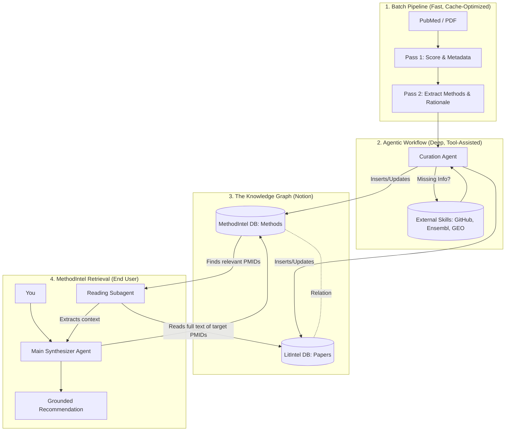

# Brainstorming: The Unified LitIntel + MethodIntel Architecture

By introducing agentic workflows and dual Notion databases, we move from a linear "data extraction" pipeline to a self-enriching "knowledge graph." Here is how the pieces fit together conceptually.

## 1. The "Knowledge Graph" (Dual Databases)
Right now, the pipeline crams everything about a paper into a single Notion row. By splitting this, we create a relational knowledge base:

*   **LitIntel DB (The Papers):** Stores the summary, biological findings, cohorts, and validation status.
*   **MethodIntel DB (The Tools):** Stores the computational methods, algorithms, and implementations (e.g., "Leiden clustering via Scanpy").

**The Integration:** When the pipeline runs, it links them. A method in the MethodIntel DB will have a relation field showing every paper in the LitIntel DB that used it. You stop asking "What paper used this?" and start asking "What are all the methods used by papers in this cohort?"

## 2. The Agentic Curator (The "Glue")
Instead of rigid Python code mapping JSON fields to Notion columns, an **Agent** sits at the end of the pipeline.

*   **Gap Filling:** The Agent looks at the extracted method: *"The paper says they used Seurat, but didn't specify the version."* The Agent uses a skill to check the paper's provided GitHub link, finds the `renv.lock` or `environment.yml` file, and extracts the Seurat version.
*   **Curation:** The Agent writes a custom, human-readable summary tailored for your Notion view, deciding what is most important rather than just dumping raw JSON strings.

## 3. The Data Flywheel & Subagent Synthesis
Once `LitIntel` is feeding both databases, `MethodIntel` (your router and CLI) becomes incredibly powerful. You move away from generic web searches and rely entirely on your own curated literature index.

### Concrete Example: Louvain vs. Leiden
1. **Indexing:** The pipeline processes Paper A (uses Louvain) and Paper B (uses Leiden). The `MethodIntel DB` now links both methods to their respective papers.
2. **Context Capture:** The pipeline processes Paper C, which explicitly states *why* they chose Leiden over Louvain (e.g., "Leiden resolves poorly connected communities better than Louvain"). The Agent extracts this rationale and attaches it to the Leiden entry in the `MethodIntel DB` as a "Tradeoff Reference" pointing to Paper C.
3. **Subagent Delegation:** When you ask the system, *"Why should I use Leiden instead of Louvain for my new dataset?"*
    * The Main Agent doesn't just do a Google search. 
    * It checks the `MethodIntel DB` and sees the links to Papers A, B, and C.
    * It spawns a **Subagent** to specifically read the full text of Papers A, B, and C to extract their specific clustering contexts.
4. **Final Synthesis:** The Main Agent synthesizes the subagent's findings and gives you an answer grounded 100% in your own indexed papers: *"Based on Paper C in your library, Leiden is preferred because [reason], which is consistent with the shift we see where newer papers (Paper B) use Leiden while older ones (Paper A) used Louvain."*

## Architecture Visualization

